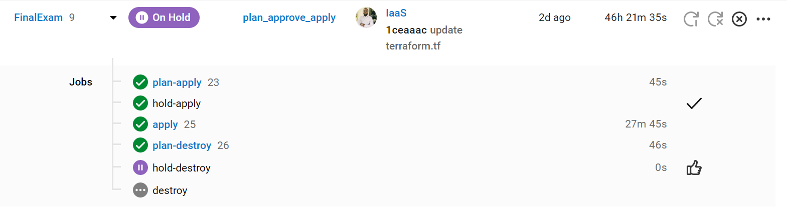
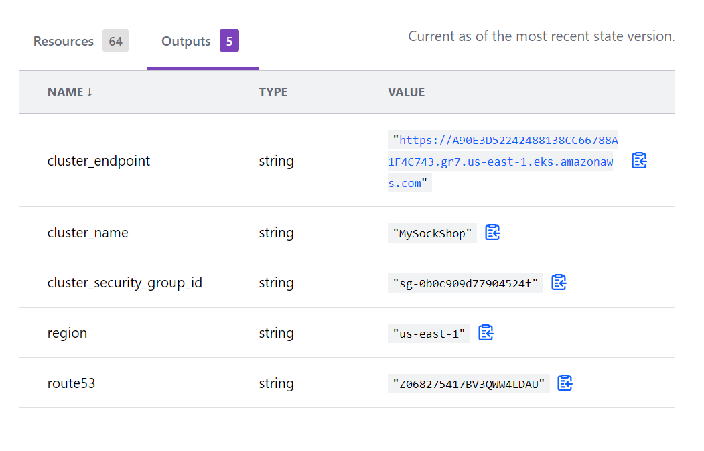

# This is my 3rd semester project in AltSchool
## Project Task
- Deploy the "sock-shop microservice app"
- Deploy a webapp (mongodb and mongo-express).
- Set up prometheus monitoring for both app

## Requirements
- AWS Account
- TerraformCloud Account
- CircleCi Account
- Github Account

## Steps
1. Create a github repo with 2 braches (main & IaaS)
2. Craete workspace with the same name as the git repo on TerraformCloud.
3. Create a new project tracking the IaaS brach on Circleci
4. Set all neccessary environment variables in circleci
5. Prepare terraform files and circleci config file in IaaS brach to provision eks cluster and Route53 hosted zone. This is done according to the instruction [here](https://developer.hashicorp.com/terraform/tutorials/automation/circle-ci) and [here](https://developer.hashicorp.com/terraform/tutorials/kubernetes/eks)
6. Commit all changes to IaaS branch, this will triger deployment on circleci  

  

7. Get terraform output from terraformcloud  
  
  

8. update the context of kubeconfig by running  
    
    _aws eks --region your-region update-kubeconfig --name clustername_ 

9. cd to sock-shop dir. Adjust the frontend service to use loadbalancer rather than Nodeport in the original sock-shop documentaion.

```

  apiVersion: v1
kind: Service
metadata:
  name: front-end
  annotations:
        prometheus.io/scrape: 'true'
  labels:
    name: front-end
  namespace: sock-shop
spec:
  type: LoadBalancer
  selector:
    name: front-end
  ports:
  - protocol: TCP
    port: 80
    targetPort: 8079

```
  - cd to manifest-monitoring, adjust both promethues and grafana services to use loadbalancer type as well

  - Run the following command in the sock-shop directory to deploy the app and prometheus.  
            ```
                kubectl apply -f sock-shop.yml
                kubectl create -f manifests-monitoring
            ```
10. cd to webapp dir. and run the following command to deploy the mongo app  
            ```
                kubectl apply secret.yml
                kubectl apply -f mongo.yml
            ```
  - Download helm charts and install mongodb-exporter
            ```
                helm repo add prometheus-community https://prometheus-community.github.io/helm-charts
                helm install mongodb-exporter  prometheus-community/prometheus-mongodb-exporter -f values.yml -n monitoring
            ```
11. Get the servicse by running ~kubectl get services --all-namespaces~
    - Three namespaces are created in the deployment
       - sock-shop
       - webapp
       - monitoring

12. Get external IP (loadbalancer arn) of sock-shop, webapp, prometheus and grafana.

13. cd to A_records
    - create terraform files to create A-records for the endpoints
    - do ~terraform plan~ then ~terraform apply~

14. Apps and monitoring tools can be reach at
    - [webapp](webapp.ridwandemo.me)
    - [sock-shop](sock-shop.ridwandemo.me)
    - [prometheus](prometheus.ridwandemo.me)
    - [grafana](grafana.ridwandemo.me)

sock-shop a6a6803f2fca045f8be8d805c9a121eb-1639442620.us-east-1.elb.amazonaws.com  1  
webapp a5877883ff5cb404a82fb5eb9a5e50a2-1267176436.us-east-1.elb.amazonaws.com 0  
prometheus a6c2a1db862214cd1b4c3ebea879dd42-1286728352.us-east-1.elb.amazonaws.com  2  
grafana aa7f3945b08dc491ea8f8d1fd482b96c-1461062469.us-east-1.elb.amazonaws.com  3
